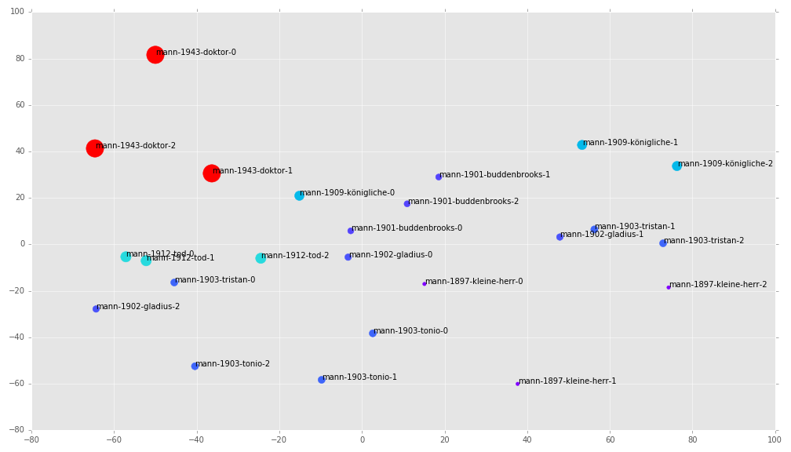
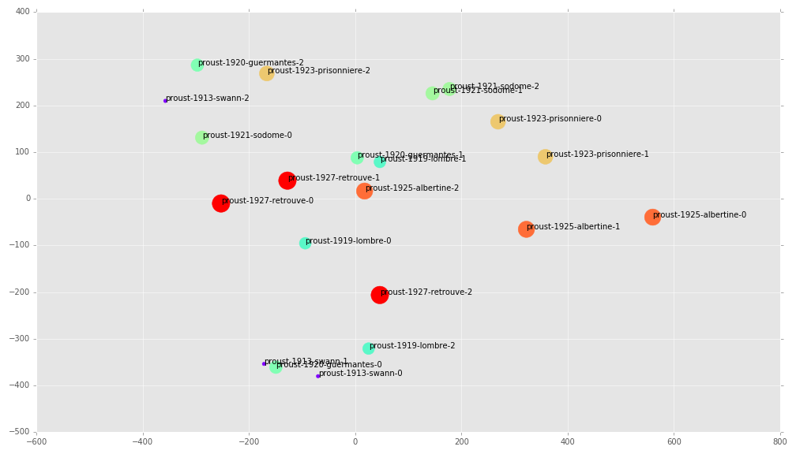
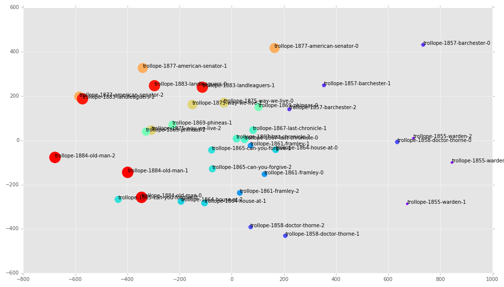
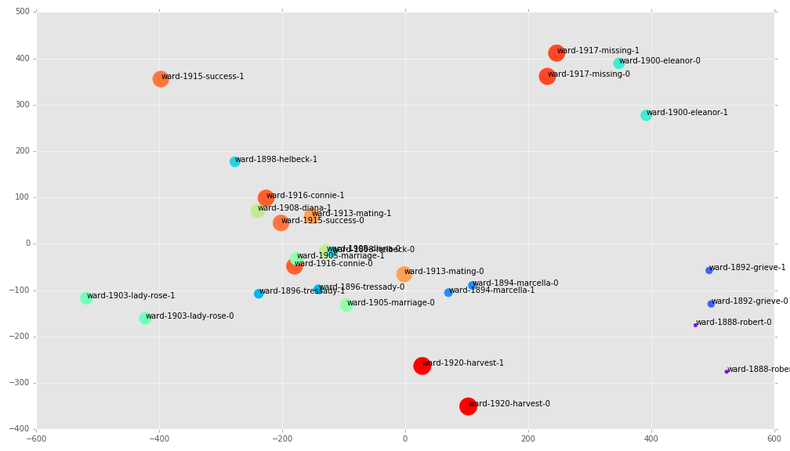
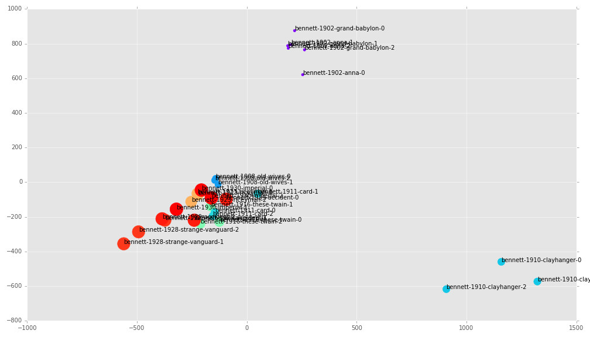

Does “late style” exist? That is, do artists exhibit a well-defined and distinctive stylistic shift as they reach old age, artistic maturity, or both? If so, what are the characteristics of such a style? Edward Said's _On Late Style: Music and Literature Against the Grain_ argues not only that such a style does exist, but that it has very particular characteristics. Said’s volume is itself a last work, and is an unfinished work that concerns unfinished works, a fact which deepens the recursivity and reflexivity of his argument. Said describes late style as, somewhat paradoxically, involving “a nonharmonious, nonserene tension, and above all, a sort of deliberately unproductive productiveness going _against_” [-@said_late_2006 22]. The term “late style,” derived from Thodor Adorno’s concept of Beethoven’s _Spästil_, is one which Adorno conceives of as “catastrophic” [@adorno_late_2002 567]. As Adorno puts it, “the maturity of the late works of significant artists does not resemble the kind one finds in fruit. They are, for the most part, not round, but furrowed, even ravaged. Devoid of sweetness, bitter and spiny, they do not surrender themselves to mere delectation” [-@adorno_late_2002 564]. While Adorno later qualifies this view as “inadequate,” and the autobiographical basis for interpretation as “deceptive,” this nonetheless remains a position which Said supports more than Adorno, and one which he applies to a wide variety of arts and artists [-@adorno_late_2002 564, 566]. To determine whether this claim is more than just anecdotally true, it deserves to be experimentally tested. A computational stylometric analysis of the statistical similarities among a writer’s works might be able to show how similar or dissimilar a writer’s late works are to the rest of their corpus. If their late works are decidedly different, late style could be said to exist. If not, then these claims might necessitate reevaluation.

In 1989, Said taught a course at Columbia University called “Last Works/Late Style.” The course description bears quoting at length, since it is perhaps the most succinct description of late style as Said understood it:

>A study of two related phenomena in the history of the arts. One, the last works by an artist, particularly those that offer a new vision of reconciliation and mortality as expressed through the forms of art (Shakespeare, Sophocles, Ibsen). Two, a study of a new style that emerges in the work of an artist in the last phases of a career, the phenomenon identfied by Adorno as Spästil, for whom Beethoven is the prototype. Hence, Beethoven himself, Adorno’s reflection on the style ... , Mann’s redoing of Adorno in _Dr Faustus_, plus the study of artists (Cavafy, Genet, Lampedusa, Richard Strauss, G.M. Hopkins, Beckett, Glenn Gould, Proust) whose work expresses lateness through the peculiarities of its style. An underlying theme is the artist who does not express the prevailing _Zeitgeist_, who is out of synch with the time. _Spästil_ as anachronism and anomaly. [@said_edward_1989] 

In Said’s lecture notes, he refers to “late style” as: “in career (vs. early) pronounced subjectivity / over and beyond its time / a governing aesthetic, different from others because of lateness / discordance, unresolved duality / unrest, restless, defiant / [containing] forms of nostalgia, sentimentality, longing, excess, going beyond the limits of taste; overdone” [-@said_edward_1989]. This quality of being “different from others,” if we can interpret this to mean, in part, the difference between an writer’s late works and earlier works, might be experimentally discernible in a given texts’s statistical similarities.

#Experimental Design

This study builds on the work done in computational stylometrics by David Hoover and John Burrows. Burrows successfully uses principal component analysis (PCA) of word frequency distributions to identify authorial stylistic voices. Hoover uses this technique, and others, to determine chronological correlations in a corpus of Henry James’s novels. Hoover concludes that “Henry James ... has a style that resides not only in the tendency of his late novels toward convoluted syntax, but also in the frequencies of words of various kinds. ... But that distinctive style is not monolithic. Rather, it develops so gradually and consistently throughout his career that quantitative evidence from his use of words places his novels in almost perfectly chronological order” [-@hoover_corpus_2007 193]. If Hoover’s stylometric analysis of James, based on a statistical analysis of word frequencies, can determine chronological changes in a writer’s style, then perhaps this same technique can be used to computationally identify late style.

To study a writer’s works diachronically, it was necessary to first amass a large collection of his or her electronic texts. This first meant selecting writers that were prolific enough to have a discernible late style. If a writer only published a few novels, generic or other stylistic differences between novels might overshadow chronological ones. Similarly, it was necessary to select writers who wrote with relative generic stability. No matter how prolific they were, writers like H. G. Wells with high genreric range had to be disqualified from this selection. Finally, authors needed to be selected whose works were in electronic form and downloadable on the Internet. It was thus impractical to study the late style of Jean Genet, one of the writers Said discusses the most, since the late work he discusses, _Un Captif amoreux_, was first published in 1986, and does not seem to have an electronic edition available. 

Said’s course syllabus includes required readings in Sophocles’s _Oedipus at Colonus_, Euripedes’s _Bacchae_, Shakespeare’s _Winter’s Tale_, Thomas Mann’s _Doctor Faustus_,  Beckett’s _Endgame_, poems by Gerard Manley Hopkins, Proust’s _Time Regained_, poems by Cavafy, two works by Jean Genet, and essays by Glenn Gould [-@said_edward_1989]. Since the following will be an experiment in the computational literary analysis of relatively recent literature, the authors studied here will be Thomas Mann, since his works are discussed directly by Said; Marcel Proust, whom Said also discusses; Anthony Trollope, a very prolific 19th century British writer; Arnold Bennett, a prolific British writer of the early 20th century; and Mary Augusta Ward, also a prolific writer of the early 20th century, who published under the name Mrs. Humphry Ward.

Amassing corpora for these writers was by far the most time-consuming task of this study. The texts were downloaded mostly from Project Gutenberg and similar text repositories, such as WikiSource. In some cases, as with [Proust’s novels on WikiSource](https://fr.wikisource.org/wiki/Auteur:Marcel_Proust), the novels were originally in EPUB form, and were converted to plain text, and stripped of remaining HTML tags. Next, each file had to be manually cleaned. Some text files contained transcriptions of the tables of contents, lists of illustrations, and even ads for other books published by the same publisher. Others contained just the text itself, and others yet contained the full Project Gutenberg license. Since initial experiments showed unusual results for texts that still contained these irregularities, each text file was trimmed so that it contained the minimum of paratextual features, such as chapter headings. This procedure was conducted semi-manually, with the help of some macros written for the text editor Vim, on all 52 total texts used in this experiment. 

To statistically analyze these texts, I wrote [a script in the Python programming language](https://github.com/JonathanReeve/late-style-PCA/blob/master/late-style-PCA.ipynb). The script uses the Python library NLTK (Natural Language ToolKit) for text manipulation, Pandas for data manipulation, Numpy for matrix calculations, Matplotlib for data visualization, and Scikit-Learn for principal component analysis. It starts by reading each text into memory, converting it to lowercase, and dividing it by token using the NLTK Punkt tokenizer. This tokenizer considers tokens to include words, punctuation, and other syntactic elements such as the “n't” contraction suffix of “don’t.” From there, texts are broken into n pieces of equal length. This division is important to test the functioning of the statistical analysis---if it works correctly, two or three pieces of a novel should show similarity to each other. This division is also useful is showing a text’s internal cohesion. By this measure, a novel will show its parts to be more cohesive than will those of a short story collection. 

Since the analysis to follow depends on the comparison of word frequencies, it was necessary that each text piece be equal in word count. In order to maximize the compared text, yet ensure equal text lengths, the algorithm starts by finding the text in the corpus with the smallest word count, and then truncates all other texts to that length. This is somewhat problematic, if the internal styles of a novel are to be considered different from each other, because it means that the style of the full shortest novel is compared with, say, the middle or the beginning of a much longer novel. This means that, in some cases, the length of the text itself is not considered to be a stlyistic feature, but rather, style is considered only on the level of the paragraph or chapter. 

The resulting tokenized text pieces are then analyzed for word frequency using the NLTK’s Word Frequency Distribution class. This class simply counts the number of times each token occurs in a piece, and divides by the total number of tokens in the text. Since statistical analyses of the top 100, 400, 800, and total set of words were all tested, and no great difference was found in their similarities, the top 100 most frequently used words were used here, in order to save time on computation (each analysis takes the computer about 30 seconds to complete). These wordlists, consisting of the counts of the top 100 most frequently used words in each part of each novel, are then merged into a master table, usually of around 125-200 words, representing the word frequencies of each word in all novels. 

If this master table consists of 200 columns (one column per word), and each cell in the table contains the count for that word in a particular piece of a novel, then each of the columns in this table may be considered its own dimension. The table, then, exists in 200-dimensional space. This dimensionality is not very useful for human analysis, so a dimensionality reduction technique is needed in order to identify significant vectors (eigenvectors) in this high-dimensional space. This is the task of principal component analysis---it identifies n principal components, that is, significant vectors in this high-dimensional data set, mean-centers the data, and replots it along these dimensions so that it can be more readily understood by humans. In this case, the PCA algorithm is instructed to identify two principal components in the corpus, so that each piece of each novel will be represented by X and Y values that can be plotted on a simple two-dimensional Cartesian coordinate system. The result is a graphical representation of the similarity of the word frequency lists. Given the success of David Hoover and John Burrows’s experiments in sylometric PCA, these measures can therefore be called, with a reasonable degree of confidence, measures of the similarities of the novels’ styles. 

Furthermore, a new metric is introduced here, $\Delta$, to measure the deviation of a text from the mean. $\Delta$, not to be confused with Burrows’s measurement Delta, represents the distance of a novel in PCA space from the mean of that author’s corpus. This is calculated, using the Pythagorean theorem, as $$\Delta(x,y) = \sqrt{x^2 + y^2}$$ where $x$ and $y$ are the coordinates of the text along the principal components, in mean-centered PCA space. A high $\Delta$ score represents the distinctiveness of the text, and a low $\Delta$ score represents how typical the text is to rest of the writer’s corpus. In short, the $\Delta$-score correlates approximately with distinctive style.

#Results 

As previously mentioned, Thomas Mann was a appropriate subject for this study since he is so frequently discussed in Said’s _On Late Style_, and since _Doktor Faustus_ appears on Said’s syllabus. Mann had a long writing career, publishing the short story collection _Der kleine Herr Friedemann_ in 1898 at age 23, and the novella _Die Betrogene_ in 1953, at age 78, two years before his death in 1955. _Doktor Faustus_ was published fairly late, as well, in 1947. Said’s interest in _Docktor Faustus_ owes in part to Adorno’s contributions, and to the fact that it directly treats, as well as exhibits, late style, such as in Adrian Leverkühn’s discussion of late Beethoven, a passage which Said identifies as “pure Adorno”: 

>Beethoven’s art had overgrown itself, risen out of the habitual regions of tradition, even before the startled gaze of human eyes, into spheres of the entirely and utterly and nothing—but personal—an ego painfully isolated in the absolute, isolated too from sense by the loss of his hearing; lonely prince  of a realm of spirits, from whom now only a chilling breath issued to terrify his most willing contemporaries, standing as they did aghast at these communications of which only at moments, only by exception, they could understand anything at all. 
[-@said_late_2006 23-4]

Said cites this passage as a further definition of late style, as given here by Mann and Adorno, and also as an illustration of Adorno’s preoccupation with “the figure of the aging, deaf and isolated composer,” one whose late works “often communicate an impression of being unfinished” [-@said_late_2006 24-5]. But is _Doktor Faustus_ itself an _instance_ of late style? It was one of Mann’s last works, created when he was 72 years old, only eight years before his death. Yet critics typically regard it as a stylistically and aesthetically consummate work of Mann’s, not only not “unfinished,” or in Adorno’s terms, “ravaged,” “furrowed,” and “bitter,” but Mann’s greatest achievement. As J.P. Stern puts it, “the impression ... we are left with is one of immense narrative ease behind the complex syntactic devices ... Of this idea and mode of life _Doctor Faustus_ is the final and greatest embodiment” [-@stern_thomas_1989 738]. 

{#fig:mann} 

[@fig:mann] shows the results of the PCA of Mann’s novels, using the 100 most frequent words. The sizes of the circles, as well as their colors, are representations of the dates of publication. The colors are scaled according to the colors of the rainbow, so that violet colors represent the earliest novels, and red colors represent the latest. Unfortunately, there are gaps in this corpus, due to the unavailability of electronic texts after the 1920s, which explains the absence of orange or green-colored points here. The most typical Mann novels occur closest to the mean, at (0,0), and the most atypical novels are the outliers. On the whole, the PCA shows principal components that align fairly well with chronology: the earliest works are in the southeast, and the chronology progresses fairly evenly toward the northwest. 

_Doktor Faustus_, represented in its three parts as the three large red circles in the northwest corner of the chart, is fairly atypical. The beginning of the novel---the 0th part---is the most atypical of the three, while the two remaining parts are more typically Mannean. The most atypical work, however, the one with the highest $\Delta$-score, is not _Doktor Faustus_ at all, but Mann’s very early work, _Der kleine Herr Friedemann_. As a collection of short stories, this probably explains why the style is so divergent from his other works. _Königliche Hoheit_ (“Royal Highness”), another relatively early work of Mann’s, has the second highest $\Delta$-score. As a romantic comedy and “a story of princely initiation told in the easy style of an ironic fairy tale for grown-ups” this is atypical for Mann, and generically experimental [@stern_thomas_1989 737]. 

Interestingly, although it does not have a high $\Delta$-score, the most proximate novel in the galaxy of _Doktor Faustus_ is _Der Tod in Venedig_ (“Death in Venice”). Said recognizes this novel as an instance of late style that is stylistically, although not chronologically, late. The titular death of the novel is a suggestion of mortality that Said correlates with late style. As he explains, “within Mann’s novella, Aschenbach’s half-aware and yet inevitable voyage to Venice induces in the reader the sense that because of various premonitions and past associations (e.g., Wagner’s own death there in 1883) and its own peculiar character, Venice is a place where one finds a special finality” [-@said_late_2006 164]. Said argues that it is “paradoxical” that the work is an early one in the author’s chronology, due to its “autumnal and even at time elegiac qualities.” Of Benjamin Britten’s operatic adaptation, too, he questions whether it “can be regarded as being in more than a chronological sense a _last_ work” [-@said_late_2006 163]. In this sense, we might view the proximity of _Der Tod in Venedig_ with _Doktor Faustus_ as an indication that the work is, as Said suggests, late.

Proust’s _Le Temps retrouvé,_ known in English as _Finding Time Again_ and _The Past Recaptured_, appears on Said’s syllabus with the possibly self-translated hybrid title _Time Recaptured_. In his introduction to _On Late Style_, Michael Wood notes that Said’s papers for his Late Style course contains passages from Proust, following a note about “conversion of time into space” [-@said_late_2006 5-7]. Proust’s novel, the final installment of his magnum opus _A la recherche du temps perdu_, deals explicitly with time and aging. As Adam Watt describes one such passage: “after long illness and absence from society life, the Narrator returns to one last matinée at which he meets many figures from his distant past. Time has changed them, aged and distorted their faces, their gait” [-@watt_cambridge_2011 17]. In particular, the narrator sees M. d’Argencourt, whom he regards “as a puppet, a trembling puppet with a beard of white wool” [quoted in @watt_cambridge_2011 17]. This is a picture of old age in which the body is no longer in control of itself [@watt_cambridge_2011 17]. Since this is Proust’s last novel, we are tempted to read this as a projection of the sick and dying Proust himself. But the chronology of _À la recherche_ complicates this view. 

Proust oversaw the publication of the first four volumes in the series, _Du côté du chez Swann_, _À l'ombre des jeunes filles en fleurs_, _Le Côté de Guermantes_, and _Sodome et Gomorrhe_, but the last three, _La Prisonnière_, _Albertine disparue_ (also called _La Fugitive_), and _Le Temps retrouvé_, were all published posthumously from his manuscripts. Although Proust died in 1922, the last three works were published in 1923, 1925, and 1927, respectively. But they weren’t necessarily written in this order. Marion Schmid writes that Proust had written large parts of _Le Temps retrouvé_ between 1910 and 1911, before the publication of the first volume [-@bales_birth_2001 64]. In 1913 he imagined _À la recherche_ to have three parts: _Du Côté du chez Swann_, _Le Côté de Guermantes_, and the third _Le Temps retrouvé_ [-@bales_birth_2001 66]. Proust expanded the novel in 1914, but expanded it from the middle, adding the ‘Albertine cycle’ of _La Prisonnière_ and _Albertine disparue_, while the beginning and the end remained the same [-@bales_birth_2001 67]. 

{#fig:proust} 

[@fig:proust] shows a PCA of the volumes in _À la recherche du temps perdu_. Unlike with Mann, the late volumes here are not outliers, but having low $\Delta$-scores and being situated close to the mean, they are stylically very typical Proust works. This suggests that if Proust has a late style, it is not, in fact, reflected in _Le Temps retrouvé_, as its inclusion in Said’s syllabus might suggest. Rather, the late work is a different volume in the series: the text segment with the highest $\Delta$-score is the beginning segment of _Albertine disparue_ (_La Fugitive_), while the second and third highest $\Delta$-scoring segments are from _La Prisonnière_. Since these volumes likely contain the latest of Proust’s writings, the $\Delta$-score again seems to correlate with lateness. But as with Mann, early works have high $\Delta$-scores, as well---_Du côté du chez Swann_ is the novel with the third-highest overall $\Delta$-score, suggesting a distinctive early style, as well. Here, Said is correct that Proust has a distinctive late style, but identifies this style in the wrong novel.

Although not discussed by Said, another author whose late works might be said to exemplify Adorno’s “devoid of sweetness, bitter and spiny” is Anthony Trollope. Of _The Land-Leaguers_, one of Trollope’s final works, Richard Mullen writes that it “lacks the sparkle and occasional satire one associates with most of his other works. It is filled with violence, hatred, unpleasant characters and cross-gained lovers set against a background of terrorism” [-@mullen_penguin_1996 271]. A contemporary reviewer, C.E. Dawkins, regrets that it lacks “those shrewd and half-humorous disquisitions about men and things which the author loved,” and that this suggests, of Trollope’s talent, that “the stream was getting dry” [@smalley_trollope_1969 520]. It is no perhaps no wonder, then, as Donald Smalley writes, that “no one at the time of publication or since has shown any great enthusiasm for the work” [-@smalley_trollope_1969 518].

Trollope wasn’t always so bitter, of course. Henry James argues that, although he “does not, to our mind, stand on the very same level as Dickens, Thackeray and George Eliot ... he belonged to the same family” [@smalley_trollope_1969 525]. Trollope was highly prolific, and was writing up until his death in 1882, at age 67. In a letter to Alfred Austen in 1876, he described his attitude toward old age: “I observe when people of my age are spoken of, they are descried as effete and moribund, just burning down the last half inch of the candle in the socket,” he wrote, “I feel as though I should still like to make a ‘flare up’ with my half inch” [quoted in @tracy_trollopes_1978 322]. That attitude is akin to Said and Adorno’s descriptions of late style, and is something that might be detectable with the statistical analysis to follow. 

{#fig:trollope} 

[@fig:trollope] shows a PCA of twelve of Anthony Trollope’s novels. Somewhat like the PCA of Mann, this trend shows remarkable regularity in its chronology. The principal component represented by the X axis is almost perfectly chronological, with Trollope’s earliest novels, such as _The Warden_, in the east, and his latest ones, such as _An Old Man’s Love_, in the west. The novels with the highest $\Delta$-scores, however, are not the latest ones, but the earliest ones: _The Warden_ and _Barchester Towers_, both part of Trollope’s _Chronicles of Barsetshire_ series. This is another instance of the distinctiveness of early over late style. Perhaps this can be explained in part by what Robert Tracy calls Trollope’s “constant experimentation and evolution.” Tracy notes that “Trollope seems to have been continually challenging himself by abandoning any theme, method, or social subject that he felt he had mastered” [-@tracy_trollopes_1978 5].

The third highest $\Delta$-score of Trollope’s belongs to the late _The American Senator_, followed by _An Old Man’s Love_. Of Trollope’s late novels, James Kincaid argues that they can appear, at first glance at least, to be “the random experiments of some mad scientist” [-@kincaid_novels_1977 234]. “The novels beginning with _The American Senator_,” he explains, “offer not only new combinations in narrative patterns of comedy, irony, and tragedy, but also a new generic range from anatomy to satire to romance.” [-@kincaid_novels_1977 234]. These generic experiments might help to explain why these novels are statistical outliers. 

Another novel in this group, _An Old Man’s Love_, seems to share some of the characteristics Said identifies for late style. Like Proust’s _Le Temps retrouvé_, and indeed like Said’s _On Late Style_, this was a posthumously published novel. Although Trollope’s _The Land-Leaguers_ technically comes later, Richard Mullen, using the same terms as Said, claims that its “elegiac tone” makes it “a far more appropriate farewell than that sad and uncompleted novel, _The Land-Leaguers_” [-@mullen_penguin_1996 363]. The subject matter implied by the title makes it even more appropriate, given the “subjectivity” of old age suggested by Adorno and Said. The way Mullen describes Whittlestaff, the “Old Man” of the title, is even more so: 

>We would not consider him an ‘old man’ for when the novel begins he is fifty. Trollope, however, often exaggerated the influence of age, ... In addition, Trollope, who was in his late sixties when he wrote the book, did think that the passing of fifty years combined with Whittlestaff’s personality had produced an ‘old man.’ He is that familiar figure of Victorian legends ... a man whose whole life has been darkened by being jilted by his beloved.” [@mullen_penguin_1996 364] 

Analyses of other novelists might help to prove that $\Delta$-scores correlate with late style, and minimize the impact of selection bias. [@fig:ward] shows a PCA of the novels of Mary Augusta Ward, who wrote under her married name of Mrs. Humphry Ward. As with the analysis of Trollope’s novels, Ward’s early novels appear in the list of highest $\Delta$-scores. Her most successful novel, _Robert Elsmere_, is in this list, as well as the subsequent novel, _The History of David Grieve_. Both of these novels deal with what Dinah Birch calls “contrasting traditional belief with the values of progress and intellectual freedom,” and they cluster together here in the southeast corner of the chart. Ward’s latest novel, the 1920 _Harvest_, although it doesn’t have a high $\Delta$-score, does appear to stand alone here at the bottom of the chart. The 1917 novel _Missing_ also appears to be an outlier, although so does the 1900 _Eleanor_. The PCA of Ward is an interesting counterpoint to that of Trollope or Mann. Like Proust, her novels don’t group together well on a chronological basis, but unlike Proust, she didn’t write them out of order. 

Perhaps the components the PCA identifies are correlated with genre. An early analysis of Ward’s work showed that the novel with the highest $\Delta$-score was her earliest novel, _Milly and Olly_, published in 1881. Upon closer examination, however, this novel turns out to be a children’s book, so its statistical dissimilarity to her other novels, written for adults, comes as no surprise. Perhaps genres could explain the other outliers, as well. If _Eleanor_ deals with a woman’s succumbing to tuberculosis, and _Missing_ is a war novel, then perhaps their common themes of impending death make them not only similar to each other, but late stylistic outliers. 

{#fig:ward} 

The PCA of Arnold Bennett’s novels, shown in [@fig:bennett] is the most anomalous of all analyses considered here. Apart from two isolated groups, which are extremely atypical groups, most of the novels cluster around the mean---early novels and late novels alike. This suggests that with a few exceptions, Bennett’s style is relatively stable, that in effect, he has very little late style. He might be said to have an early style, however, for his earliest novels, _Anna of the Five Towns_ and _The Grand Babylon Hotel_, both published in 1902, appear in an isolated cluster in the north. _Clayhanger_, one of Bennett’s most successful novels, appears in the southeast. Although both _Clayhanger_ and _Anna of the Five Towns_ are outlier novels, both of them taking place in the Straffordshire Potteries, they are also statistically dissimmilar, and appear here at great distance to each other. The most probable narrative to describe this chart is that Bennett began with the style of the 1902 novels, changed to his major style shortly thereafter, and continued in that style the rest of his life, with the exception of the atypical _Clayhanger_ in 1910. 

{#fig:bennett} 

#Conclusions

The statistical analyses presented here show that late style is distinct only in a few cases, where it is weakly distinct, at best. Thomas Mann shows a very regular stylistic evolution over his career, without breaking noticeably from it. Proust shows a more pronounced late style, although it aligned with the chronology of composition, rather than publication, as Said suggests. But these were novelists that Said selected to prove his point about late style, so this selection might already be biased. Anthony Trollope, shows perhaps the most regular stylistic evolution, and has a somewhat distinct late style. Mary Augusta Ward seems to have a fairly consistent style, with a few outliers, and Arnold Bennett even more so.

Regardless of whether these authors have a discernible late style, however, most have a well-defined early style. One might fairly ask, then, where is the book _On Early Style_? An early style that would apply to all authors is perhaps a ridiculous notion, since every author starts in very different places. Ward’s children’s novel might not be easily compared with Mann’s first collection of short stories, for instance. But if we apply this critique to the claims of late style, the same might also be true of late style. This might further call into question Said’s claims. Even if we can show statistically that some authors have divergent styles late in their careers, these styles are not necessarily identical between these authors, and to speak of a uniform late style across authors and genres is no more valid than speaking of a uniform early style.

Said reads Adorno’s Beethoven as “inhabit[ing] the late works as a lamenting personality,” which seems true if we recall the beginning of the Ninth Symphony, but less true if we remember that it also contains the Ode to Joy [-@said_late_2006 26]. On this basis, at least, it is hard not to see Said’s concept of late style, and Adorno’s, as little more than anecdotal. We must conclude that late style does, in fact, exist for individual authors, to weak degrees, but as to whether such a style represents a widespread phenomenon, more experiments are needed.
