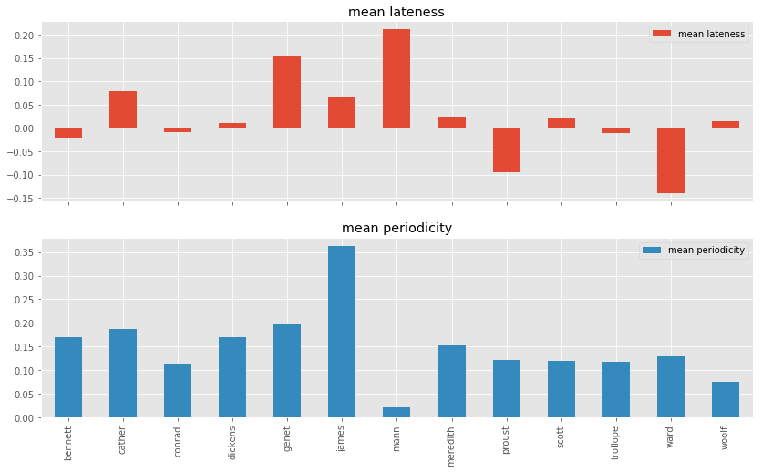

## The Problem

The idea has persisted for centuries: that artists, whether writers, painters, or musicians, dramatically change their artistic styles in their final years, or in the final stages of their careers. If this sounds vague, it is. "Late style," as it is known, or _Spätstil_ in German criticism, has been used to explain the last works of, among others, Shakespeare, Beethoven, Goethe, Proust and Picasso. The late style of these artists have been the primary concern of numerous recent monographs [see, for example, @wheeldon2009debussy; @solomon2004late; @neumann1959; @smit1988language; @lipking1984life; @van2016anthony]. 

One especially notable book on the subject is Edward Said's _On Late Style: Music and Literature Against the Grain_, a work which primarily expands Theodor Adorno's theories of late style in Beethoven to literature, covering Marcel Proust, Jean Genet, Thomas Mann, and C.P. Cavafy, among others. Said's book is itself a work of late style, and was posthumously compiled from his speeches, notes, and course materials: in the '90s, Said had taught a course at Columbia University called Late Style, which included required readings in Sophocles’s _Oedipus at Colonus_, Euripedes’s _Bacchae_, Shakespeare’s _Winter’s Tale_, Mann’s _Doctor Faustus_,  Beckett’s _Endgame_, poems by Gerard Manley Hopkins, Proust’s _Time Regained_, poems by Cavafy, and two works by Genet [-@said_edward_1989]. 

But what Said and Adorno mean, precisely, by "late" or "lateness" isn't always clear. Michael Wood's introduction seems to summarize some of Said's definitions, while acknowledging the slipperiness of the term: 

> It’s worth pausing over the delicately shifting meanings of the word late, ranging from missed appointments through the cycles of nature to vanished life. Most frequently perhaps late just means “too late,” later than we should be, not on time. But late evenings, late blossoms, and late autumns are perfectly punctual—there isn’t another clock or calendar they are supposed to match. Dead persons have certainly got themselves beyond time, but then what difficult temporal longing lurks in our calling them “late”? Lateness doesn’t name a single relation to time, but it always brings time in its wake. It is a way of remembering time, whether it is missed or met or gone. (5)

In introducing his argument, Said posits "three great human episodes common to all cultures and traditions," the third of which he intends to study (19). The third episode is characterized by the contrariness that is implied in the subtitle, _Music and Literature Against the Grain_. This opposition, or incompatibility, may be directed towards to one's own time, one's prior works, or the contemporary status quo. It "involves a nonharmonious, nonserene tension, and above all, a sort of deliberately unproductive productiveness going _against_" (21). This is also Adorno's view, whom Said quotes here: "the maturity of the late works,” according to Adorno, “do not resemble the kind one finds in fruit. They are ... not round, but furrowed, even ravaged. Devoid of sweetness, bitter and spiny, they do not surrender themselves to mere delectation" (26). 

If we are generous, we might read "the late works," here as "these particular late works," rather than "all late works," or even "most." Yet Said implicitly extends his argument well beyond just the works he discusses in their volume, as do most critics writing about late style. If this is true, it is a very bold and far-reaching claim, and one which might be testable and, to some extent, falsifiable. 

Yet there are few sustained critiques of late style in English literary studies. Two works that approach a critique include Gordan McMullan's recent monograph _Shakespeare and the Idea of Late Writing_, and his edited volume _Late Style and Its Discontents_ [-@McMullanShakespeareIdeaLate2007; -@mcmullan2016late]. McMullan traces the history of the idea, which he sees as an extension of man-of-genius schools of criticism, especially those surrounding Shakespeare and Beethoven (17). He also notes that _man_ of genius is seemingly an important designation for earlier critics of the late style tradition, since they rarely, if ever, laud women artists as possessing this characteristic (ibid.). (And in fact, Said's syllabus features no works by women writers.)

The genealogy of late style as a critical concept, interesting though it is, is not my concern here, however. Instead, it is putting it to the test. This is an ideal job for a quantitative approach that could analyze hundreds of novels at a time, and attempt to find patterns that exhibit this late style. This is what I've tried to do here. 

## Operationalizing "Late"

We should begin by defining what we mean by "late." This is not easy, since Said's argument depends on the term's holding unresolved ambiguities. But we might be able to mitigate this problem somewhat, by operationalizing several different meanings of the word. First, let's take Said's notion of "three great human episodes" literally. 

### Late as Final Third

Most who write about "late style" of an artist describe it as an outgrowth of a late period, which itself contrasts with an early period, and sometimes a middle period. Only in a rare cases are artists' chronologies segmented much further, as in Picasso's "blue" and "rose" periods. It follows, then, that one way to operationalize lateness is to begin by dividing the works of a writer into two or three categories. 

The simplest way of categorizing works is to rescale their publication dates[^publication] to floating point numbers between zero and three, and then to round these numbers to the nearest integer. A slightly more sophisticated approach is to use Jenks Natural Breaks Optimization to find the largest gaps in the publication years, and to optimize the Goodness of Variance Fit by incrementing the number of classes until we arrive at three. We might then be able to look for what Adorno terms the "caesura," or definitive break that separates an artist's earlier from late styles. 

[^publication]: It would be far better, of course, to use the dates these works were written, rather than published, but that data is much harder to find in a machine-readable form. I decided that, since the majority of books are published in their writers' lifetimes, and chronologically according to when they're written, the gains in accuracy would not be worth the time it would take to find this data.

### Lateness as Proximity to Death

Another way of interpreting lateness is to understand it as a writer's growing awareness of his or her mortality. Writers themselves are likely the best judges of their own health, and so barring a sudden, violent death, they are likely aware of their failing health for some time---perhaps even years. This is McMullan's primary interpretation of lateness, whose _Shakespeare and the Idea of Late Writing_ is subtitled _Authorship in the Proximity of Death_. 

There are certainly writers who have struggled with debilitating illness. In "Cough Prints and Other Intimacies: Considerations in Editing Lawrence's Later Verse," for instance, Christopher Pollnitz remarks on blood spattered across D.H. Lawrence's later manuscripts, brought on by Lawrence's tuberculosis [@pollnitz1995cough]. And some read Virginia Woolf's last novel, _Between the Acts_ in light of her impending suicide [@kenney1975]. 

Since Project Gutenberg maintains author birth and death data, (even though they don't maintain publication dates) this made this one of the easier analyses to perform. To operationalize this, I assigned "early," "middle," and "late" categories, as before, only instead of basing them on publication years or their gaps, I assigned them according to when they were published with respect to the year of that writer's death. If it was published within five years, I assigned it to the "late" category; if within ten, I assigned it to "middle," and "early" to the rest. These are fairly liberal choices, I freely admit, but the object was to determine whether, should there be no statistically discernable late style, there might yet be a very late style.

### Altersstil 

A third method for operationalizing lateness is to consider "late style" to be an expression of Altersstil, or the style of old age. 

Operationalizing Altersstil might mean calculating the age of the author at each publication, and designating it Altersstil after the age of, say, 65. But would this be affected by changes in life expectancies over time? Or would this definition be different for women, who typically have longer life expectancies? 

[Section to be expanded later. Literary gerontology.] 

There are many other potential ways of operationalizing "late" which I will not explore here. One is "late" as "out of one's time," or "different from one's contemporaries, which is also a testable claim.

## Operationalizing "Style"

### Stylometry

The most obvious way to operationalize differences in style, it seems to me, is to employ the techniques of stylometry, or the statistical measurement of writing style. Although there have been a number of different approaches to stylometry over the years, one of the most successful, and one used in forensic linguistics today, is based on the most frequent words of a text. This analysis follows from the observation that frequent words tend to be function words, (_a_, _the_, _and_, etc), and infrequent words tend to carry content (_blue_, _sunset_, _Kent_). Separating style from content, by dividing words according to their ranked frequencies, has been very successful at authorship attribution, and to a lesser extent to the attribution of gender or nationality [@love_attributing_2002; @RybickiVivedifferenceTracing2015]. In fact, the proportions of single frequent words, like _an_, may even be used to tell with surprising accuracy whether a writer is likely to be British or American. Notable papers employing stylometry include John Burrows's seminal 1987 _Computation into Criticism_, which deals with Jane Austen's novels, and Hugh Craig and Athur Kinney's 2009 _Shakespeare, Computers, and the Mystery of Authorhip_, which gives detailed attributions for segments of the bard's collaboration with Christopher Marlowe [@burrows_computation_1987; @craig_shakespeare_2009].

Stylometry has also been used on a few occasions to study diachronic changes in a single-author corpus. David Hoover, in "Corpus Stylistics, Stylometry, and the Styles of Henry James," uses stylometric methods to show differences between James's much-discussed early and late periods [-@hoover_corpus_2007-1]. Carmen Klaussner and Carl Vogel use this method to predict chronology in James and Mark Twain, and arrive at a root mean squared error of $\pm 7.2$ years [-@klaussner2015stylochronometry]. Richard Forsyth, in a recent study of what he terms "stylochronometry," differentiates between "younger Yeats" and "older Yeats," devising along the way a measurement he calls a "youthful Yeatsian index." [-@forsyth1999stylochronometry] Finally, Dirk van Hulle and Mike Kestemont use stylometry to periodize Samuel Beckett's works, and find an instance of late style in his last work, _Worstword Ho_. "[T]he unique position of _Worstword Ho_ in the stylometry analyses," they conclude, "indicates that, when Beckett was almost eighty years old, he still managed to write a work that was stylistically so innovative that it constitutes yet another turning point" [-@van_hulle_periodizing_2016 196]. These are all remarkable case-studies of single authors, but do these trends hold true at a bigger scale?

The methods of these, and other stylometric studies, are to compare the writing styles of texts by comparing the frequencies of the first 100-800 words. Sometimes this is done using Burrows's Delta method, or variations thereof, but often these frequencies are compared with a multivariate technique like Cluster Analysis, or Principal Component Analysis (PCA) [@burrows_delta:_2002; @smith_improving_2011]. To choose the appropriate technique, I ran a grid search over roughly 9,000 possible parameter combinations, including vectorization techniques (adjusting document frequency with inverse document frequency using TF-IDF, for instance), numbers of most frequent words, dimensionality reduction techniques, and clustering techniques. The best-performing methods and parameters were document frequency vectors of the top 800 most frequent words, reduced with PCA to five principal components, and clustered in these five dimensions with a Bayesian Gaussian mixture model with a maximum number clusters of three. The advantage of using the Bayesian model here is that it can infer the numbers of clusters, thereby accomodating writers whose styles have one cluster (no distinct styles), two clusters (early and late styles), or three clusters (early, middle, and late styles). 

Since we're working in 5-dimensional space, we can quantify the distinctiveness of a document as we would a vector, by taking the $L_5$ norm, also denoted $\|x\|_5$, and defined as

$$\|x\|_5 = \left( \sum_i \|x_i\|^5 \right)^\frac{1}{5}$$

where $x_i$ are the PCA-reduced word frequencies of each text. A high $L_5$ could be read as a proxy for the stylistic distinctiveness of the text, and a low $L_5$ could be read as a proxy for how stylistically typical the text is with respect to the writer's corpus. 

### Style as Content: Word Vectors

Paradoxically, style can also be construed as content. We might read Said's description of late style as "bitter" and "spiny" as describing the _content_ of the lateness, instead of its _manner_, i.e. _what_ is said, rather than _how_ it is said---not a complaining manner of speaking, for instance, but a complaint itself. Taken as such, stylometry would not be able to detect this style-as-content. To test this, we would instead need a method that takes content into account. 

For this, I chose to use word embeddings, first developed at Google, by Tomas Mikolov, et al [-@mikolov_2013]. Since word embeddings encode the collocations of words with their contexts in millions of documents, they are often used as useful proxies for meaning, encoded as n-dimensional vectors. As vectors, I can reuse the rest of my clustering pipeline. I chose to use Stanford University's Global Vectors for Word Representation, 300-dimensional vectors pre-trained on millions of web documents [@pennington2014glove]. Of course, there will be some anachrony present here, as contemporary web pages do not exhibit the same semantics as nineteenth-century novels, but, after all, we want to compare meanings as they are construed by readers today, rather than insist on historical accuracy. 

Since I use raw document frequencies as preliminary vectors for both of these corpora, I had to apply caution with respect to document length. Since it's unfair to compare the frequency of a word, especially an infrequent word, in two documents of very different lengths (a given word simply has more of a chance to appear in a longer text), I first split each text in two. This allows me to see whether the style of a text is self-similar, thereby acting as a sanity check for the stylometric parameters. From there, I draw random samples from each text segment, each with the length of the shortest segment. I then perform 10 iterations of the entire analysis---random sampling, dimensionality reduction, and clustering---to ensure that these samples are fairly representative, and any resulting metric represents the average of all of these trials. 

### Other Operationalizations

There are many other possible ways to test style, of course. A third way is to assume that style is reflected not in the words used, but in their syntatic relations, that the composition of a sentence reveals the most about style. 

[Section forthcoming. Ideas for how to do this are welcome!]

It would be impossible to consider all possible operationalizations of literary style here, but a few more warrant mentioning. One is style in the wake of success: how might a growing readership change a writer's style? (I suspect that James Joyce's nine-year attempt at publishing _Dubliners_ would have been much longer if _Finnegan's Wake_ were instead his first book.) Is style-after-success a more statistically significant shift than that which one might find in old age, or faced with impending death? Similarly, would other major life events affect a writer's literary style, like marriage, parenthood, or graduation from an MFA program? 

## Corpora

The texts I chose to analyze belong to two corpora: one curated corpus, composed of writers either directly discussed by Said, or otherwise well-known for their periodicity; and another, much larger, automatically generated corpus. The curated corpus includes the writers Marcel Proust, Jean Genet, and Thomas Mann, who are either directly discussed in _On Late Style_, or appear on Said's course syllabus[^corpus]. (I used the original-language versions of all of these texts, and adjusted my tokenizer for these languages.) To these, I added writers either well known for their periodicity (James and Dickens), or their relative stylistic uniformity (George Meredith, Willa Cather). I also included a few popular but now lesser-studied writers, Mary Augusta Ward (who published as Mrs. Humphry Ward), and Arnold Bennett, the villain, one might say, of Virginia Woolf's famous essay "Mr. Bennett and Mrs. Brown." I manually annotated each text with publication dates, and cleaned up the OCR using a semi-automated method.

The second corpus I automatically generated using [Corpus-DB](http://corpus-db.org), a SQL database wrapper and REST API I created for Project Gutenberg and other texts, with enhanced metadata aggregated from DBPedia and library APIs. I queried this database for all plain text files categorized with the Library of Congress Classification "PR" (British Literature) that are written by writers with more than eight total works available in English. I chose to narrow these to this LCC so as to minimize international stylochronometric difference, and I chose nine as a reasonable number for dividing into groups of three---had I included writers who wrote only two novels, the clustering algorithm might unfairly ascribe early style to one, and late style to the other. The generated corpus originally contained works by 141 writers, but only 51 of those writers had publication data publicly available on DBPedia. The final generated corpus features roughly 900 works from these 51 writers.

## Metrics

I define the "lateness" of a work $w$ as how different the work's style is, statistically speaking, from the rest of the author's corpus. Formally, this is the absolute value of the average deviation from the mean, in five-dimensional PCA vector space, of the centroids of the single-author corpus's $c$'s samples, i.e. $\{ w_1, w_2 ... w_n\}$. The vectors of the samples themselves are either PCA-reduced document frequency (DF) vectors, or style-as-content word embedding vectors. Since PCA collapses many of the distances here, this must be proportional: 

$$Lateness(w) \propto | \frac{ \sum_1^n \|w_{i5}\| }{ n } | $$

The measure may be adapted to compute the "lateness" of a writer, by finding the centroid, in 5-D, of the Bayesian-clustered category containing the works with the latest publication dates (automatically detected "late works"), and subtracting the Euclidean distance to the centroids of the early works. A positive lateness score would indicate a measure of "late style," a score of zero would indicate no statistically significant stylistic variation at all, and a negative score would indicate "early style," or statistically significant differences between early works and the mean.

A writer's lateness may be further adapted to compute the periodicity of a writer, by comparing the periods pre-clustered according to their publication dates with the periods inferred by stylometric clustering. Thus, if one-dimensional clustering of an author's publication chronology, using Jenks Natural Breaks Optimization, returns a categorization scheme for three clusters, those three clusters are compared with the clusters inferred by the Bayesian Gaussian mixture model using an Adjusted Rand Index, which computes the mutual information of these clusters, regardless of their labels or numbers [@rand1971]. 

[^corpus]: Since many of these texts are not yet out-of-copyright, obtaining them in some cases has meant special-ordering their delivery from France, cutting the binding with a "book guillotine," and scanning them with a sheet-feeder. 

## Results: Curated Corpus

[@fig:curated] shows the mean latenesses and mean periodicities of the writers in the curated corpus. Four writers have noticeable lateness scores: Mann, Genet, Cather, and to a lesser extent, James. Since Said devotes chapters to both Mann and Genet in _On Late Style_, and more than one volume has been devoted to the late style of James [see, for example, @smit1988language], this shouldn't be very surprising. In fact, this seems to confirm Said's intuitions, at least with respect to these particular exemplars. The bigger picture isn't as convincing, however: Dickens, Scott, Meredith, and Woolf show very miniscule late styles; Conrad and Bennett show negative latenesses (their early styles are slightly more distinct), and both Proust and Ward show highly negative late styles.

{#fig:curated} 

The average lateness score for this corpus is 0.03, a very weak case for late style, and this is a corpus whose writers were selected largely because they are known for lateness. 

Curiously, the lateness scores don't align with the periodicities. There, it seems that most writers exhibit roughly the same periodicities, excepting Mann, who scores much lower, and James, who scores much higher. A few of these deserve a closer look.

### Case Study: Henry James

[@fig:james] shows the first two components of the PCA-reduced vector space of Henry James's novels, with each novel represented as two samples. The sizes of the points represent their relative chronology: smaller points for earlier works, and larger points for later works. The colors of the points represent how they are clustered by the Bayesian Gaussian mixture model, in five dimensions. 

{#fig:james}

This is one of the most uniform and successful clustering experiments in this corpus: the first, yellow cluster contains only novels published in the '70s and '80s. The second, purple cluster contains mostly novels from the '90s and early 1900s. The third, mostly the 1900s and 1910s. 

The outliers here, with the highest lateness scores, are one sample from _The Ambassadors_ (1903), both samples of _The Sacred Fount_ (1901), and earlier works. These are not exactly James's latest works---but then again, James does not have a very high lateness score, comparatively. His periodicity, however, is remarkable, and that is reflected in this analysis. 

### Case Study: Marcel Proust

Marcel Proust is one of the more interesting cases here, since 
[@fig:proust] shows that the most distinctive of Proust's works are not his early or late works, but those in the middle. Proust’s _Le Temps retrouvé,_ known in English as _Finding Time Again_ and _The Past Recaptured_, appears on Said’s syllabus with the possibly self-translated hybrid title _Time Recaptured_. In his introduction to _On Late Style_, Michael Wood notes that Said’s papers for his Late Style course contains passages from Proust, following a note about “conversion of time into space” [-@said_late_2006 5-7]. Proust’s novel, the final installment of his magnum opus _A la recherche du temps perdu_, deals explicitly with time and aging. As Adam Watt describes one such passage: “after long illness and absence from society life, the Narrator returns to one last matinée at which he meets many figures from his distant past. Time has changed them, aged and distorted their faces, their gait” [-@watt_cambridge_2011 17]. In particular, the narrator sees M. d’Argencourt, whom he regards “as a puppet, a trembling puppet with a beard of white wool” [quoted in @watt_cambridge_2011 17]. This is a picture of old age in which the body is no longer in control of itself [@watt_cambridge_2011 17]. Since this is Proust’s last novel, we are tempted to read this as a projection of the sick and dying Proust himself. But the publication chronology of _À la recherche_ complicates this view. 

{#fig:proust}

Proust oversaw the publication of the first four volumes in the series, _Du côté du chez Swann_, _À l'ombre des jeunes filles en fleurs_, _Le Côté de Guermantes_, and _Sodome et Gomorrhe_, but the last three, _La Prisonnière_, _Albertine disparue_ (also called _La Fugitive_), and _Le Temps retrouvé_, were all published posthumously from his manuscripts. Although Proust died in 1922, the last three works were published in 1923, 1925, and 1927, respectively. But they weren’t necessarily written in this order. Marion Schmid writes that Proust had written large parts of _Le Temps retrouvé_ between 1910 and 1911, before the publication of the first volume [-@bales_birth_2001 64]. In 1913 he imagined _À la recherche_ to have three parts: _Du Côté du chez Swann_, _Le Côté de Guermantes_, and the third _Le Temps retrouvé_ [-@bales_birth_2001 66]. Proust expanded the novel in 1914, but expanded it from the middle, adding the ‘Albertine cycle’ of _La Prisonnière_ and _Albertine disparue_, while the beginning and the end remained the same [-@bales_birth_2001 67]. This seems to explain how these works are statistical outliers here. Said was right about Proust's late style, after all, but not in the way he imagined. 

### Case Study: Thomas Mann

Thomas Mann was a appropriate subject for this study since he is so frequently discussed in Said’s _On Late Style_, and since _Doktor Faustus_ appears on Said’s syllabus. Mann had a long writing career, publishing the short story collection _Der kleine Herr Friedemann_ in 1898 at age 23, and the novella _Die Betrogene_ in 1953, at age 78, two years before his death in 1955. _Doktor Faustus_ was published fairly late, as well, in 1947. Said’s interest in _Docktor Faustus_ owes in part to Adorno’s contributions, and to the fact that it directly treats, as well as exhibits, late style, such as in Adrian Leverkühn’s discussion of late Beethoven, a passage which Said identifies as “pure Adorno”: 

>Beethoven’s art had overgrown itself, risen out of the habitual regions of tradition, even before the startled gaze of human eyes, into spheres of the entirely and utterly and nothing—but personal—an ego painfully isolated in the absolute, isolated too from sense by the loss of his hearing; lonely prince  of a realm of spirits, from whom now only a chilling breath issued to terrify his most willing contemporaries, standing as they did aghast at these communications of which only at moments, only by exception, they could understand anything at all. [-@said_late_2006 23-4]

Said cites this passage as a further definition of late style, as given here by Mann and Adorno, and also as an illustration of Adorno’s preoccupation with “the figure of the aging, deaf and isolated composer,” one whose late works “often communicate an impression of being unfinished” [-@said_late_2006 24-5]. But is _Doktor Faustus_ itself an _instance_ of late style? It was one of Mann’s last works, created when he was 72 years old, only eight years before his death. Yet critics typically regard it as a stylistically and aesthetically consummate work of Mann’s, not only not “unfinished,” or in Adorno’s terms, “ravaged,” “furrowed,” and “bitter,” but Mann’s greatest achievement. As J.P. Stern puts it, “the impression ... we are left with is one of immense narrative ease behind the complex syntactic devices ... Of this idea and mode of life _Doctor Faustus_ is the final and greatest embodiment” [-@stern_thomas_1989 738]. 

{#fig:mann} 

[@fig:mann] shows the results of the PCA of Mann’s novels. Unfortunately, there are gaps in this corpus, due to the unavailability of electronic texts after the 1920s, which explains the absence of orange or green-colored points here. The most typical Mann novels occur closest to the mean, at (0,0), and the most atypical novels are the outliers. On the whole, the PCA shows principal components that align fairly well with chronology: the earliest works are in the southeast, and the chronology progresses fairly evenly toward the northwest. 

_Doktor Faustus_, represented in its three parts as the three large red circles in the northwest corner of the chart, is fairly atypical. The beginning of the novel---the 0th part---is the most atypical of the three, while the two remaining parts are more typically Mannean. The most atypical work, however, the one with the highest $L_5$ norm, is not _Doktor Faustus_ at all, but Mann’s very early work, _Der kleine Herr Friedemann_. As a collection of short stories, this probably explains why the style is so divergent from his other works. _Königliche Hoheit_ (“Royal Highness”), another relatively early work of Mann’s, has the second highest $L_5$ norm. As a romantic comedy and “a story of princely initiation told in the easy style of an ironic fairy tale for grown-ups” this is atypical for Mann, and generically experimental [@stern_thomas_1989 737]. 

Interestingly, although it does not have a high $L_5$ norm, the most proximate novel in the galaxy of _Doktor Faustus_ is _Der Tod in Venedig_ (“Death in Venice”). Said recognizes this novel as an instance of late style that is stylistically, although not chronologically, late. The titular death of the novel is a suggestion of mortality that Said correlates with late style. As he explains, “within Mann’s novella, Aschenbach’s half-aware and yet inevitable voyage to Venice induces in the reader the sense that because of various premonitions and past associations (e.g., Wagner’s own death there in 1883) and its own peculiar character, Venice is a place where one finds a special finality” [-@said_late_2006 164]. Said argues that it is “paradoxical” that the work is an early one in the author’s chronology, due to its “autumnal and even at time elegiac qualities.” Of Benjamin Britten’s operatic adaptation, too, he questions whether it “can be regarded as being in more than a chronological sense a _last_ work” [-@said_late_2006 163]. In this sense, we might view the proximity of _Der Tod in Venedig_ with _Doktor Faustus_ as an indication that the work is, as Said suggests, late.

### Case Study: Virginia Woolf

The novels of Virginia Woolf present another good opportunity for stylometric analysis, since they resist chronological periodicity. Recall that, in [@fig:curated] above, Woolf has the lowest periodicity scores of all the writers in this smaller, curated corpus. This is also an effect noticeable in [@fig:woolf]. The "latest," or most statistically distinct, novel in Woolf's corpus is in fact her 1931 experimental novel, _The Waves_. This should come as no surprise to those that have read it: its form, which in earlier drafts Woolf termed a "play-poem," stretches the genre of the novel toward poetry and/or drama. In fact, as the colors of this figure indicate, the clustering algorithm has categorized _The Waves_ as its own cluster, indicating it considers this book to be the only one that exhibits Woolf's late style. Woolf published two more novels, however: _The Years_ (1937) and _Between the Acts_ (1941). _The Years_ clusters together with Woolf's first novel, _The Voyage Out_ (1915), and _Between the Acts_ clusters together with her third, _Jacob's Room_ (1922). 

{#fig:woolf}

Interestingly, although most of the novels here seem cohere---that is, both the first and second samples appear close to each other---one novel, _To the Lighthouse_, appears with its two samples in very different areas of this vector space, and thus at highly divergent lateness values. The first part of the novel appears in a cluster with _The Voyage Out_ (1915), _Night and Day_ (1919), and _Mrs Dalloway_(1925), and carries a relatively low lateness score ($L_5$ norm) of 0.19. In contrast, the second part is the second most distinct sample of all, after _The Waves_, with a lateness score of 0.37. It is clear that the stylometric analysis here detects the middle section of _To the Lighthouse_, an experimental section with a very distinct voice, which Woolf originally wrote and published as a separate work.

Here again, of course, we can make more of a case for a cohesive early, rather than late style, since all Woolf's 1910s novel cluster together, along with _Mrs Dalloway_ and the first part of _To the Lighthouse_. The late works, in contrast, appear all over this chart. It appears that, early in Woolf's career, her style was fairly regular, but like James Joyce and other modernists, in some respects, she became bolder in her experimentation late in life. 

## Results: Generated Corpus

The above findings may be interesting, but the corpus is consciously biased, since I chose to test the works of writers whom critics have already selected as exhibiting late style. A much larger corpus should mitigate this somewhat. [@fig:everyone-late] shows average lateness scores for all the writers in the generated corpus. Of special note here are the authorial appellations _Anonymous_ and _Various_, which of course include the works of more than one person. I've included these just out of curiosity, but am surprised to see that they have almost the lowest lateness scores.

At a glance, it is apparent that there are more negative scores than positive ones, and that the negative scores show up to a 50% stronger signal. The mean lateness score for the corpus is -0.019, meaning that, among these 51 authors, early style is more statistically significant than late.

{#fig:everyone-late}

Again, the periodicities do not show the same trends. [@fig:everyone-period]  shows that most writers show strongly-defined periods (or that the periodicities of most writers may be computationally predicted). We might say, reading this graph, that John Galsworthy has the most regular style of these writers, and Lewis Carroll the most periodic. Perhaps Galsworthy's regularity might be owed to his long-running series, _The Forsyte Saga_. Carroll's periodicity is surprising, since he mostly writes childrens' fantasies. But maybe it is precisely the fantastic signal---that of imagination---that bleeds into style, and thus periodicity?

{#fig:everyone-period}

This picture changes fairly dramatically, if we shift our definition of lateness to mean proximity to death. In my opinionated operationalization of this effect, most writers exhibit late style. The abundance of writers showing lateness scores of exactly zero means that these are writers who have no texts (in my corpus, at least), published within five or ten years before their deaths. 

There are also striking changes from other interpretations of style. Most noticeably, Shakespeare moves from showing only a minor lateness score to showing the highest, and almost double that of the rest. In a more dramatic shift, Oscar Wilde moves from having the fourth-lowest lateness score to the second-highest, by this metric. 

{#fig:everyone-tdd}

However, this provides only a very weak case for late style. The mean lateness score of all 51 writers is only 0.022, and if we remove Shakespeare it falls to 0.018. 

## Results: Style as Content

If we consider style as content, as in [@fig:embed-late], the picture is not very different from that of style as style. A few writers change position, from showing distinctive early styles to showing distinctive late styles: Oscar Wilde changes polarity like this, for instance. Here again, the mean lateness value is negative, -0.029, meaning that early style is more distinctive than late according to this measure, and that it is even more distinctive than when we operationalize style using stylometry. 

{#fig:embed-late}

Periodicities for these writers, as measured by style-as-content, shift somewhat, as shown in [@fig:embed-period]. According to this metric, most writers now show negative periodicities, meaning that their works are not easily clustered into distinct periods on the basis of their words' meanings alone. 

{#fig:embed-period}

# Conclusions

To conclude, here is a summary of results:

  1. In a test of 900 books by 51 British writers, early style is more statistically significant than late style.
  1. Yet in a test of hand-picked writers known for their late style, late style is more significant.
  1. Most writers show two or three statistically discernable stylistic periods, when style is interpreted as the way in which one writes, i.e. with which function words. 
  1. When we interpret style as content, however, these periods are much less pronounced, and most writers do not have statistically discernable styles (negative periodicities). 
  1. When we interpret style as content, late style is less pronounced, and early style is more pronounced. Here again, early style is more statistically significant. 

It is clear to me from this analysis that "late style," as a critical concept, should be treated with suspicion, at best, and that "early style," which is not currently discussed to the same degree among literary critics, should be given more attention.

## Further Work

Beyond simply testing and disputing the claims of Said and Adorno, the techniques developed here may be applicable to other problems in single-author corpora. Further analyses might include investigations into the effects of marriage on a writer, or parenthood. Furthermore, comparative stylochronometry might also prove fruitful: a preliminary comparison of Jane Austen and George Eliot novels show that while the two begin by writing in very different styles, their later works are stylometrically very similar. Another analysis might involve a comparison of literary biographies with the works of that author. [Any more ideas here for further work?]

# Works Cited
